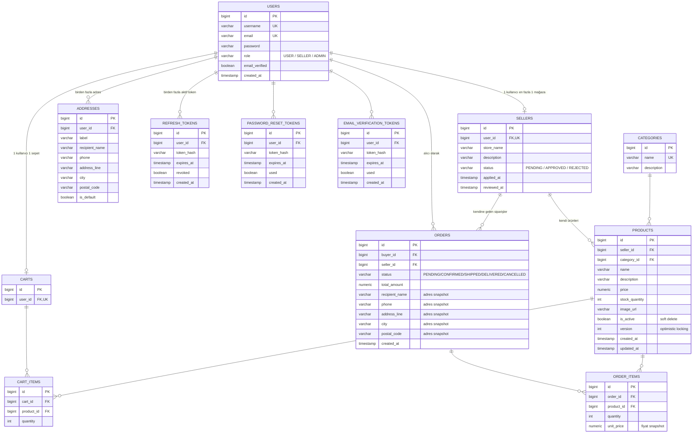

# Database Şeması

PostgreSQL, Flyway ile versiyonlanır (`ddl-auto: validate` — şema her zaman migration dosyalarından yönetilir, Hibernate asla otomatik değiştirmez).

## ER Diyagramı

## Tablo Detayları

### `users`
| Alan | Tip | Kısıt | Not |
|---|---|---|---|
| id | BIGINT | PK, identity | |
| username | VARCHAR | UNIQUE, NOT NULL | |
| email | VARCHAR | UNIQUE, NOT NULL | |
| password | VARCHAR | NOT NULL | BCrypt hash |
| role | VARCHAR | NOT NULL, DEFAULT 'USER' | USER / SELLER / ADMIN |
| email_verified | BOOLEAN | NOT NULL, DEFAULT false | `false` iken login reddedilir |
| created_at | TIMESTAMP | NOT NULL | |

Admin, self-serve bir endpoint ile oluşturulmaz — normal kayıt + veritabanında elle `UPDATE`.

### `refresh_tokens`
| Alan | Tip | Kısıt | Not |
|---|---|---|---|
| id | BIGINT | PK | |
| user_id | BIGINT | FK → users.id, NOT NULL | |
| token_hash | VARCHAR | NOT NULL | Ham token değil, hash'i saklanır |
| expires_at | TIMESTAMP | NOT NULL | |
| revoked | BOOLEAN | NOT NULL, DEFAULT false | Logout'ta true olur |
| created_at | TIMESTAMP | NOT NULL | |

Her `/api/auth/refresh` çağrısında ilgili satır `revoked=true` yapılıp yeni bir satır eklenir (rotation). Ham token, kullanıcıya **httpOnly Secure `SameSite=None` cookie** olarak verilir — JSON gövdesinde asla dönmez, JS tarafından okunamaz. Detay için `PROJECT_PLAN.md` §4.1.

### `email_verification_tokens`
| Alan | Tip | Kısıt | Not |
|---|---|---|---|
| id | BIGINT | PK | |
| user_id | BIGINT | FK → users.id, NOT NULL | |
| token_hash | VARCHAR | NOT NULL | |
| expires_at | TIMESTAMP | NOT NULL | |
| used | BOOLEAN | NOT NULL, DEFAULT false | |
| created_at | TIMESTAMP | NOT NULL | |

Kayıt anında oluşturulur, doğrulama linkiyle mail atılır (Resend). Doğrulanınca `users.email_verified = true` olur.

### `password_reset_tokens`
| Alan | Tip | Kısıt | Not |
|---|---|---|---|
| id | BIGINT | PK | |
| user_id | BIGINT | FK → users.id, NOT NULL | |
| token_hash | VARCHAR | NOT NULL | |
| expires_at | TIMESTAMP | NOT NULL | Kısa ömürlü (örn. 1 saat) |
| used | BOOLEAN | NOT NULL, DEFAULT false | |
| created_at | TIMESTAMP | NOT NULL | |

### `sellers`
| Alan | Tip | Kısıt | Not |
|---|---|---|---|
| id | BIGINT | PK | |
| user_id | BIGINT | FK → users.id, UNIQUE, NOT NULL | Bir kullanıcının en fazla bir mağazası olur |
| store_name | VARCHAR | NOT NULL | |
| description | VARCHAR | NULL | |
| status | VARCHAR | NOT NULL, DEFAULT 'PENDING' | PENDING / APPROVED / REJECTED |
| applied_at | TIMESTAMP | NOT NULL | |
| reviewed_at | TIMESTAMP | NULL | Admin onay/red anında set edilir |

Reddedilen bir kullanıcı tekrar başvurursa **aynı satır güncellenir** (yeni satır açılmaz) — `status` tekrar `PENDING`'e döner.

### `categories`
| Alan | Tip | Kısıt | Not |
|---|---|---|---|
| id | BIGINT | PK | |
| name | VARCHAR | UNIQUE, NOT NULL | |
| description | VARCHAR | NULL | |

Yalnızca ADMIN yazar. Düz liste — alt kategori/hiyerarşi yok (bilinçli sadeleştirme).

### `products`
| Alan | Tip | Kısıt | Not |
|---|---|---|---|
| id | BIGINT | PK | |
| seller_id | BIGINT | FK → sellers.id, NOT NULL | Client'tan asla alınmaz, authenticated principal'dan çözülür |
| category_id | BIGINT | FK → categories.id, NOT NULL | |
| name | VARCHAR | NOT NULL | |
| description | VARCHAR(2000) | NULL | |
| price | NUMERIC(12,2) | NOT NULL | |
| stock_quantity | INTEGER | NOT NULL | |
| image_url | VARCHAR | NULL | Dış bağlantı, dosya yükleme yok |
| is_active | BOOLEAN | NOT NULL, DEFAULT true | **Soft delete** — false olunca listelerden düşer ama satır kalır |
| version | INTEGER | NOT NULL, DEFAULT 0 | JPA `@Version` — optimistic locking, overselling'i önler |
| created_at | TIMESTAMP | NOT NULL | |
| updated_at | TIMESTAMP | NOT NULL | |

Bir ürün geçmiş bir siparişte referans veriliyorsa (`order_items.product_id`) asla hard-delete edilmez.

### `addresses`
| Alan | Tip | Kısıt | Not |
|---|---|---|---|
| id | BIGINT | PK | |
| user_id | BIGINT | FK → users.id, NOT NULL | |
| label | VARCHAR | NULL | "Ev", "İş" gibi kullanıcı etiketi |
| recipient_name | VARCHAR | NOT NULL | |
| phone | VARCHAR | NOT NULL | |
| address_line | VARCHAR | NOT NULL | |
| city | VARCHAR | NOT NULL | |
| postal_code | VARCHAR | NOT NULL | |
| is_default | BOOLEAN | NOT NULL, DEFAULT false | |

Aynı anda yalnızca bir adresin `is_default=true` olması DB kısıtıyla değil, **servis katmanında** garanti edilir (bir adres varsayılan yapılırken kullanıcının diğer adresleri aynı transaction'da `false` yapılır).

### `carts`
| Alan | Tip | Kısıt | Not |
|---|---|---|---|
| id | BIGINT | PK | |
| user_id | BIGINT | FK → users.id, UNIQUE, NOT NULL | |

### `cart_items`
| Alan | Tip | Kısıt | Not |
|---|---|---|---|
| id | BIGINT | PK | |
| cart_id | BIGINT | FK → carts.id, NOT NULL | |
| product_id | BIGINT | FK → products.id, NOT NULL | |
| quantity | INTEGER | NOT NULL | |

Bir sepette farklı satıcılardan ürünler bir arada bulunabilir — kısıtlama yok, ayrım checkout'ta yapılır.

### `orders`
| Alan | Tip | Kısıt | Not |
|---|---|---|---|
| id | BIGINT | PK | |
| buyer_id | BIGINT | FK → users.id, NOT NULL | |
| seller_id | BIGINT | FK → sellers.id, NOT NULL | Her sipariş **tek bir satıcıya** ait (checkout satıcı başına ayrı sipariş üretir) |
| status | VARCHAR | NOT NULL, DEFAULT 'PENDING' | PENDING / CONFIRMED / SHIPPED / DELIVERED / CANCELLED |
| total_amount | NUMERIC(12,2) | NOT NULL | |
| recipient_name | VARCHAR | NOT NULL | Checkout anındaki adresten **snapshot** |
| phone | VARCHAR | NOT NULL | Snapshot |
| address_line | VARCHAR | NOT NULL | Snapshot |
| city | VARCHAR | NOT NULL | Snapshot |
| postal_code | VARCHAR | NOT NULL | Snapshot |
| created_at | TIMESTAMP | NOT NULL | |

`addresses` tablosuna FK **değildir** — kullanıcı adresini sonradan silse/düzenlese bile geçmiş sipariş bozulmaz (`order_items.unit_price` ile aynı snapshot prensibi).

### `order_items`
| Alan | Tip | Kısıt | Not |
|---|---|---|---|
| id | BIGINT | PK | |
| order_id | BIGINT | FK → orders.id, NOT NULL | |
| product_id | BIGINT | FK → products.id, NOT NULL | |
| quantity | INTEGER | NOT NULL | |
| unit_price | NUMERIC(12,2) | NOT NULL | Sipariş anındaki fiyat **snapshot**'ı — ürünün güncel fiyatı değişse bile geçmiş sipariş etkilenmez |

## Tasarım Prensipleri (Özet)

1. **Sahiplik her zaman backend'de belirlenir, client'tan alınmaz** — `seller_id`, `buyer_id` gibi alanlar authenticated principal'dan çözülür.
2. **Para ve adres bilgisi işlem anında donar (snapshot)** — `order_items.unit_price`, `orders.recipient_name/address_line/...`. Kaynak veri (ürün fiyatı, kayıtlı adres) sonradan değişebilir, geçmiş kayıt değişmez.
3. **Silme çoğunlukla soft delete'tir** — `products.is_active`. Geçmiş kayıtlarla FK bütünlüğünü korumak için.
4. **Eşzamanlılık, optimistic locking ile yönetilir** — `products.version`, kilitlenme yerine çakışmayı retry/hata olarak yüzeye çıkarır.
5. **Şema düz tutulur** — kategori hiyerarşisi yok, ürün varyantı yok; her ürün tek satıcıya ait (aynı ürünün birden fazla satıcıda listelenmesi yok).
